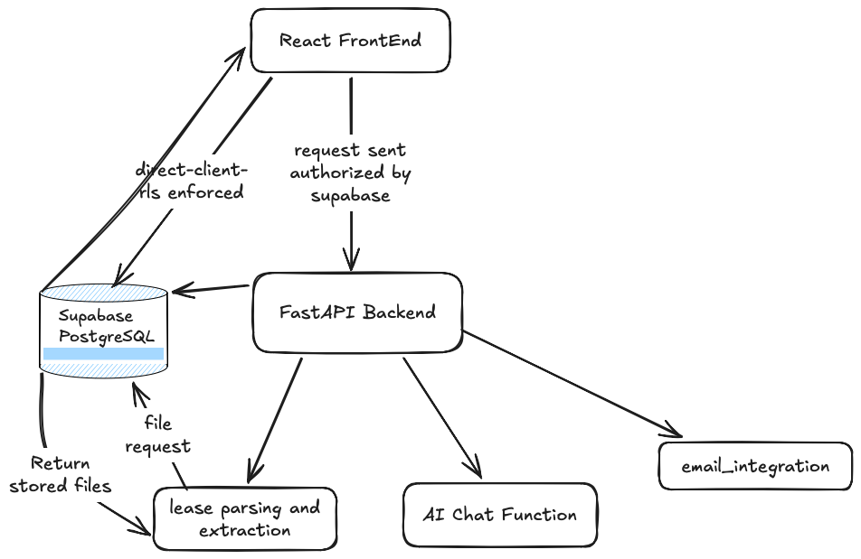

In June 2025, my partner and I set out to fix a real problem for commercial property managers: tenant lease questions that should take minutes were taking hours or days.
Commercial leases are dense and unique. Answering a specific tenant question usually means digging through paperwork to find whichever document is actually current.
We built LeaseLink to solve that. It searched across all of a tenant's documents to surface the most accurate, most recent answer, handled lease abstraction automatically, and connected to email so questions could be answered with full context.

We tested the project with 3 companies over about 6 months to a year. We tested against roughly 370 real commercial leases across three companies. 

We spent countless hours trying to perfect the Lease Abstraction process across multiple documents. We initially started with individually abstracting each document for key section and then uploading all results into supabase. This turned out to have many inaccuracies. We eventually landed on a process that determined which lease was active. (A renewal that starts in the future isn't active. Claude has specific instructions on determining active.) Any category it changed from the original or previous lease would be updated in the active section. This is one example of the problems we faced trying to create a unique product.

It wasn't commercially viable, so we wound it down. But that year taught me more than any course could: shipping fixes for real user issues, managing the full frontend-to-backend request path, and running a production Postgres database through Supabase.
That experience is what I'm building on now as I go deeper into backend and full-stack engineering.

Check Out Lease Link in action: [Lease Link Demo](https://youtu.be/o-0SNaP003A)0)

Here is the demo video: https://lnkd.in/gXW86k4x

Check out the FrontEnd Here: https://github.com/tjgrace7/LeaseLink_FrontEnd

Check out the Documentation Here: https://github.com/tjgrace7/leaselink-docs

Architecture 


[Full system diagram and architecture decisions ->](architecture.png)
# LeaseLink Backend 🏢🤖

This is the backend for **LeaseLink**, an AI-powered lease assistant designed to help property managers query, summarize, and extract insights from commercial lease documents.

Built with:
- 🧠 FastAPI
- 📄 OpenAI (GPT-4.1 for active lease dating)
- 📄 Anthropic (claude sonnet-4 main model for lease questions, extractions, and more)
- 📦 Supabase (for auth, storage, and message history)
- 🔍 Qdrant (for semantic search)
- 🧾 PDF + OCR (pdf2image, Tesseract)

---

## 🚀 Features

- Upload and process lease PDFs with OCR
- Embed lease chunks into Qdrant for semantic search
- Ask natural-language questions about a lease
- Returns responses with file references, page numbers, and optional highlights
- Supabase message history and session tracking
- Signed URLs React-based document preview

---

## 🛠️ Setup Instructions

### 1. Clone the repo

```bash
git clone https://github.com/tjgrace7/LeaseLink
cd LeaseLink

#Create a virtual environment
python -m venv venv
source venv/bin/activate  # or .\venv\Scripts\activate on Windows

#Install Dependencies
pip install -r requirements.txt

#Set up .env. DO NOT COMMIT .env to version control it's already in .gitignore
CRON_SECRET=
Claude_API_KEY=
OPEN_AI_PROJECT_KEY=
PYTHON_EDGE_SECRET=
QDRANT_API_KEY=
QDRANT_URL=
SUPABASE_JWT=
SUPABASE_PUBLIC_API_KEY=
SUPABASE_SERVICE_API_KEY=
SUPABASE_URL=
AWS_ACCESS_KEY_ID=
AWS_SECRET_ACCESS_KEY=
RESEND_SECRET_KEY=
Microsoft_Value=
Microsoft_Secret_id=
MS_CLIENT_ID=
MS_REDIRECT_URI=
GOOGLE_CLIENT_ID=
GOOGLE_CLIENT_SECRET=
GOOGLE_PROJECT_ID=
GOOGLE_AUTH_URI=
GOOGLE_TOKEN_URI=
GOOGLE_AUTH_PROVIDER_X509_CERT_URL=
GOOGLE_REDIRECT_URI=
ENCRYPTION_KEY=
BLS_API_KEY=

#Run App Locally
uvicorn app:app --reload

#project structure
.
├── app.py                  # Main FastAPI app entrypoint
├── Supabase_api.py         # Supabase read/write helper functions
├── lease_chunker.py        # Chunking and metadata tagging
├── embed_files.py          # Embedding + vector creation for Qdrant
├── Qdrant_ChatGPT.py       # GPT + Qdrant chat flow logic
├── upload_lease_manager.py # PDF processing + routing
├── .env                    # 🔒 Environment variables (not committed)
├── requirements.txt        # Dependencies
├── .gitignore              # Git exclusions

#🧠 Credits
#Maintained by @TylerGrace for Full-Stack Development.
#Built to help property managers stop digging through massive leases.
